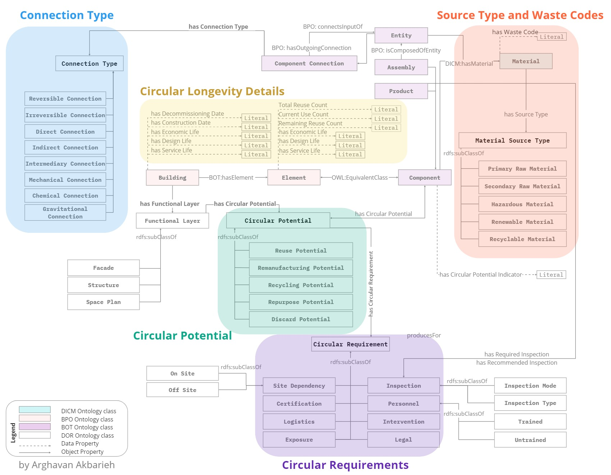

Decommissioning and Reuse Ontology (DOR)
===================
The DOR ontology focuses on capturing information related to the decommissioning processes of buildings and the subsequent reuse of building materials, components or even functional layers. It enables stakeholders to plan and execute efficient and sustainable deconstruction and post-consumer practices. The DOR ontology is developed with a trans-perspective vision, recognising the diverse interpretations and perspectives associated with the concept of reusability among different stakeholders. The ontology aims to facilitate a circular future by providing a comprehensive and time-proof circular information exchange solution that acknowledges and incorporates this inherent variability.

The DOR ontology builds upon existing Linked Building Data ontologies such as Building Topology Ontology (BOT), Building Product Ontology (BPO), and Digital Construction Materials (DICM). By extending these established ontologies, DOR ensures compatibility and interoperability with other domain-specific knowledge models and applications.

Find current version:
===================
https://z-arghavan.github.io/DORF/

**Use Cases:**
The DOR ontology serves several important use cases in the built environment domain:
1.	Pre- and Post-Deconstruction Planning: Stakeholders can utilise the ontology to enrich their information models for pre- and post-deconstruction planning. It enables them to capture and organise relevant data, facilitating effective decision-making throughout the deconstruction process.
2.	Circular Databases: The ontology supports the exchange of information with circular databases. By providing a standardised representation of concepts and relationships, it enables seamless integration of data and knowledge sharing among stakeholders in the building deconstruction and material reuse community.
3.	Material Bank Management: DOR supports the processes involved in depositing or assessing the reclaimed components in a material bank. It includes concepts for digital diagnosis, conditions for proper inventory management or remanufacturing of components in a material bank for second life cycle reuse, and documentation requirements to make sure the next reuser has enough information to make the right decisions.

  
  More process maps in: https://orbilu.uni.lu/handle/10993/58846

DOR Ontology Anatomy:
===================

**Classes**
The ontology includes the following classes:
1.	assembly
2.	Building
3.	Certification
4.	Chemical Connection
5.	Circular Potential
6.	Circular Requirement
7.	component connection
8.	Connection Type
9.	Designer
10.	Direct Connection
11.	Discard Potential
12.	element
13.	Exposure
14.	Facade
15.	Functional Layer
16.	Gravitational Connection
17.	Hazardous Material
18.	indirect connection
19.	Inspection
20.	Inspection Method
21.	Inspection Mode
22.	Intervention
23.	Legal Requirement
24.	Logistics
25.	Manufacturer
26.	Material
27.	Material Bank Agent
28.	Material Source Type
29.	Mechanical Connection
30.	Non-hazardous Material
31.	Non-renewable Material
32.	Off-site
33.	On-site
34.	Personnel
35.	Pre-Deconstruction Auditor
36.	Primary Raw Material
37.	product
38.	Recyclable Material
39.	Recycling Potential
40.	Remanufacturing Potential
41.	Renewable Material
42.	Repurposing Potential
43.	Reuse Potential
44.	Reversible Connection
45.	Secondary Raw Material
46.	Site Dependency
47.	Space Plan
48.	Structure
49.	Trained Personnel
50.	Untrained Personnel
    
**Object Properties**
The ontology defines the following object properties:
1.	Audits For
2.	Designs For
3.	has Circular Potential
4.	has Circular Requirement
5.	has Connection Type
6.	has element
7.	has Final Circular Potential
8.	has Functional Layer
9.	has Material
10.	has Recommended Inspection
11.	has Recommended Inspection Method
12.	has Recommended Inspection Mode
13.	has Required Inspection
14.	has Required Inspection Method
15.	has Required Inspection Mode
16.	has Source Type
17.	Produces For
18.	Recertifies For

    
**Data Properties**
The ontology includes the following data properties:
1.	has Circular Potential Indicator
2.	has Construction Date
3.	has Current Use Count
4.	has Decommissioning Date
5.	has Design Life
6.	has Economic Life
7.	has Remaining Reuse Count
8.	has Service Life
9.	has Total Reuse Count
10.	has Waste Code

Checkout the BE-OLS assessment:
==========
https://cyberbuildlab.github.io/BE-OLS/individualOntologyDetail.html?ontology=Decommissioning%20and%20Reuse%20Ontology

# 🧠 SPARQL Queries for Circularity, Reuse, and Regulation in BIM

This repository contains a collection of semantic queries designed to enhance understanding and data extraction for **circular construction**, **reuse potential**, and **regulatory compliance** in (open)BIM workflows.

All queries operate on an ontology developed for circular economy and digital building models, and are written in **SPARQL** using RDF-based vocabularies.

---
Example SPARQL Queries
==========
A Query to find all entities, which have any legal requirements when it comes to reuse or recycling

    PREFIX : <http://www.semanticweb.org/arnak/ontologies/2022/7/DOR#>
    PREFIX rdfs: <http://www.w3.org/2000/01/rdf-schema#>
    PREFIX ex: <http://www.semanticweb.org/arnak/ontologies/2022/7/DOR#>

    SELECT DISTINCT ?entity ?Potential2 ?Potential1 WHERE {
        ?entity ex:hasCircularPotential ?Potential1 .
        ?entity ex:hasFinalCircularPotential ?Potential2 .
        ?Potential2 ex:hasCircularRequirement ?ind .
        ex:Legal rdfs:subClassOf ?ind .
    }

-------------------------------------------------------------------------------------------------
-------------------------------------------------------------------------------------------------
A Query to find all components that have at least one entity with the waste code of 170101

    SELECT ?component WHERE {
        ?component rdf:type bpo:Component .
        ?entity rdf:type bpo:Entity .
        ?entity bpo:realisesObject ?component .
        ?entity dicm:hasMaterial ?material .
        ?material ex:hasWasteCode "170101"^^xsd:int .
    }

-------------------------------------------------------------------------------------------------
-------------------------------------------------------------------------------------------------
A Query to find all entities, which will go out of the use cycle

    SELECT (COUNT(?entity_zero) AS ?count_zero) (COUNT(?entity_nonzero) AS ?count_nonzero)
    WHERE {
        {
            SELECT ?entity_zero WHERE {
                ?entity_zero ex:hasRemainingReuseCount "0"^^xsd:int .
            }
        }
        UNION
        {
            SELECT ?entity_nonzero WHERE {
                ?entity_nonzero ex:hasRemainingReuseCount ?count .
                FILTER (?count != "0"^^xsd:int)
            }
        }
    }

General Information:
==========

This ontology is developed as a part of the PhD research study by Arghavan Akbarieh. Do not hesitate to reach out to me and have a chat about digital, circular construction.

References:
==========
1. Akbarieh, A. (2023). Information Modelling for Circular Transformation of Built Assets’ End-Of-Life. https://orbilu.uni.lu/handle/10993/58846
3. Akbarieh, A., Teferle, F. N., & O’Donnell, J. (2023). Semantic Material Bank: A web-based linked data approach for building decommissioning and material reuse. In ECPPM 2022—eWork and eBusiness in Architecture, Engineering and Construction 2022. CRC Press. 

